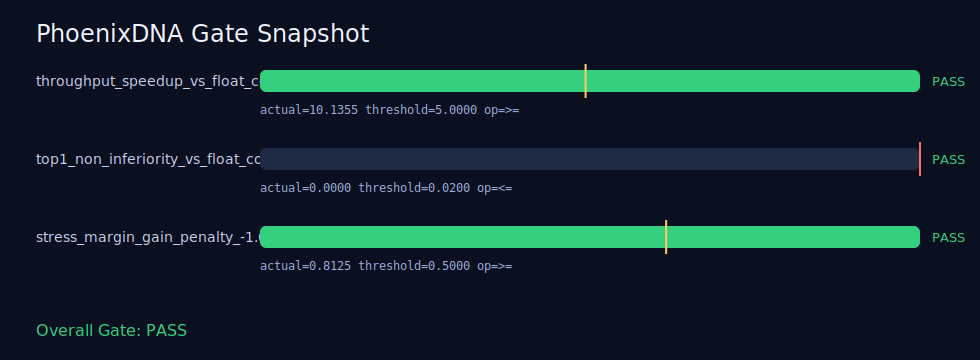

# PhoenixDNA

> Turning “AI evolution” from an idea into an executable engineering loop: reproducible, gate-validated, and runtime-writable.

中文版本: [README.md](README.md)

<a href="https://www.python.org/"></a>




## What This Is

This is a minimal reproducible project to validate one core idea:  
**AI strategies can evolve automatically through selection, instead of manual tuning every time.**

## Fast Landing (3 Values + 1 Command)

- Auto-searches better routing strategies for your Lobster runtime
- Enforces hard gate checks before deployment
- Produces integration-ready and presentation-ready artifacts

Copy & run (Windows PowerShell):

```powershell
python -X utf8 dna_benchmark.py --mode validate --dna-file phoenix_dna_quaternary_sample.json --limit 64 --sample-size 32 --mutation-rate 0.1 --repeats 1; if ($LASTEXITCODE -ne 0) { exit 1 }; python -X utf8 apply_route_policy.py; python -X utf8 value_case.py; python -X utf8 render_gate_svg.py
```

Result cards:
- `Overall: PASS/FAIL`: deployment gate verdict
- `route_policy.env`: Lobster-ready routing config
- `business_value_case.json`: business impact snapshot
- `gate_snapshot.svg`: visual gate evidence

The project provides three capability layers:
- **Research**: baselines, ablations, repeated statistics, and one-shot report generation.
- **Gate**: hard pre-deployment checks that fail fast if quality is below threshold.
- **Evolution**: population evolution (selection/crossover/mutation) with executable strategy output.

## Why It Matters

Many “evolutionary AI” projects stop at concept demos. This project focuses on engineering execution:
- Uses controlled comparisons, not subjective “feels better”.
- Uses strict quality gates before runtime entry.
- Writes learned best strategy back for direct reuse in later runs.

In one line:  
**This is not just a nice idea, but a working self-optimization pipeline.**

## Inspiration

This project starts from a practical engineering pain point:  
as Agent systems connect more models, tools, and routing rules, strategy search space explodes, while manual tuning becomes slower and less reliable.

We wanted concrete answers to three questions:
- Can we turn strategy tuning into strategy evolution, so the system searches better policies by itself?
- Can we bind optimization results to hard gates, so underperforming policies never enter runtime paths?
- Can we write back the best policy artifacts, so each run starts from the previous best point?

PhoenixDNA is the minimal executable answer to these three questions.

## Current Landscape

Many current “evolutionary AI” projects still break at one of these points:
- **Curves without admission criteria**: metrics look better, but no clear production gate.
- **Notebook-only results**: hard to reproduce across machines, parameters, and datasets.
- **Offline-only optimization**: best strategies are not directly consumable by runtime routing.

PhoenixDNA addresses this by:
- using `validate` mode as a hard gate with one-vote veto;
- exporting structured artifacts (JSON/CSV/TEX/SVG) for reproducibility and auditability;
- bridging experiment-to-runtime through `benchmark_route_policy.json` and `apply_route_policy.py`.

## Quick Start (3 Minutes)

### 1) Install dependencies

```bash
pip install -r requirements.txt
```

### 2) Run application gate validation (recommended first command)

```bash
python -X utf8 dna_benchmark.py --mode validate --dna-file phoenix_dna_quaternary_sample.json --limit 64 --sample-size 32 --mutation-rate 0.1 --repeats 1
```

Expected outputs:
- `benchmark_research_report.json`
- `benchmark_application_gate.json`
- `benchmark_research_methods.csv`
- `benchmark_research_ablations.csv`
- `benchmark_research_stress.csv`
- `benchmark_research_tables.tex`

### 3) Run evolution mode

```bash
python -X utf8 dna_benchmark.py --mode evolution --dna-file phoenix_dna_quaternary_sample.json --limit 64 --generations 6 --population-size 24 --evolution-sample-size 32 --mutation-rate 0.08 --evolution-selection-ratio 0.25
```

Expected outputs:
- `benchmark_evolution_report.json`
- `benchmark_route_policy.json`

### 4) Generate business value snapshot

```bash
python -X utf8 value_case.py
```

Expected output:
- `business_value_case.json` with speedup, latency reduction, Top1 delta, and stress margin gain.

### 5) Generate visualization

```bash
python -X utf8 render_gate_svg.py
```

Expected output:
- `gate_snapshot.svg` for GitHub-ready gate result presentation.

### 6) Generate minimal integration entry

```bash
python -X utf8 apply_route_policy.py
```

Expected outputs:
- `route_policy.env`
- `apply_route_policy.ps1`
- `route_policy_summary.json`

Optional: write artifacts into `out/` to keep repository root clean:

```bash
python -X utf8 value_case.py --input-dir . --output-dir out
python -X utf8 render_gate_svg.py --input-dir . --output-dir out
python -X utf8 apply_route_policy.py --input-dir . --output-dir out
```

## TL;DR (for Lobster Operators)

Your Lobster system handles conversation and execution. PhoenixDNA handles:
- strategy optimization,
- production gate checks,
- and runtime-ready policy artifacts.

## One-Command Integration (Immediate Results)

Windows PowerShell:

```powershell
python -X utf8 dna_benchmark.py --mode validate --dna-file phoenix_dna_quaternary_sample.json --limit 64 --sample-size 32 --mutation-rate 0.1 --repeats 1; if ($LASTEXITCODE -ne 0) { exit 1 }; python -X utf8 apply_route_policy.py; python -X utf8 value_case.py; python -X utf8 render_gate_svg.py
```

macOS / Linux:

```bash
python -X utf8 dna_benchmark.py --mode validate --dna-file phoenix_dna_quaternary_sample.json --limit 64 --sample-size 32 --mutation-rate 0.1 --repeats 1 && python -X utf8 apply_route_policy.py && python -X utf8 value_case.py && python -X utf8 render_gate_svg.py
```

Immediate outputs:
- gate verdict (`Overall: PASS/FAIL`)
- deployable `route_policy.env`
- business snapshot `business_value_case.json`
- visual proof `gate_snapshot.svg`

## Direct Mapping to Lobster Value

- Need better model/tool routing → PhoenixDNA searches better strategies  
- Need safe deployment → `validate` acts as hard gate  
- Need fast integration → `apply_route_policy.py` exports `route_policy.env`  
- Need proof for stakeholders → `value_case.py` + `render_gate_svg.py`

## Adoption Modes (low to high effort)

- **Gate-only**: integrate `validate` into CI
- **Gate + Route**: run `evolution + apply_route_policy`
- **Full**: add `value_case + render_gate_svg` for reporting

## Structure

```text
phoenixdna/
├─ apply_route_policy.py
├─ value_case.py
├─ render_gate_svg.py
├─ dna_benchmark.py
├─ phoenix_dna_quaternary_sample.json
├─ requirements.txt
└─ tools/
   └─ dna_codec.py
```

## Core Innovations

- **Trial generation**: automatically generates candidate strategies and compares them.
- **Quality filtering**: strategies that fail gate thresholds are rejected.
- **Inheritance loop**: better strategies enter next generations through crossover and mutation.
- **Runtime landing**: best result is exportable for runtime routing.

This shifts AI systems from repeated manual tuning to continuous automatic optimization.

## Reproducibility Promise

- Every key mode runs with single commands.
- All report artifacts are auto-generated to files.
- Supports fixed-parameter reruns for clean experiment comparison.

## Use Cases

- Agent routing strategy search
- Model/tool selection optimization
- Pre-release quality gate automation
- Evolutionary strategy experiments requiring explainability and reproducibility

## Roadmap

- Add more public baseline tasks
- Add multi-objective optimization (success rate / latency / cost)
- Improve visualization and comparison outputs
- Harden standalone open-source release process
